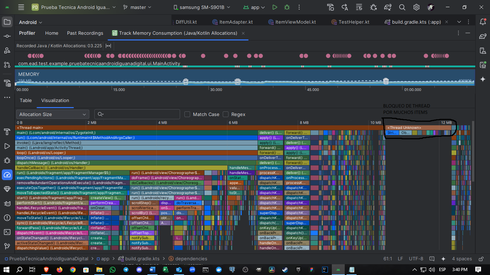

# **Prueba Técnica para Desarrolladores Android**

## **Descripción**
Este proyecto es una prueba técnica diseñada para evaluar habilidades en:
- Desarrollo de aplicaciones Android usando **Kotlin** y **Fragments**.
- Uso de **Dagger Hilt** para la inyección de dependencias.
- Gestión y optimización de scripts de compilación en **Gradle**.
- Implementación de listas eficientes con **RecyclerView** y **DiffUtil**.
- Prevención de errores comunes en la interfaz y en la configuración de dependencias.

---

## **Estructura del Proyecto**
### **1. Funcionalidades**
- **Fragmentos:**
  - `ListFragment`: Muestra una lista de elementos en un `RecyclerView`.
  - `EditFragment`: Permite agregar o editar un elemento de la lista.
- **Gestión de datos:**
  - Uso de `ViewModel` y `LiveData` para mantener y observar los datos.
  - `ItemAdapter` implementado con `DiffUtil` para mejorar el rendimiento al actualizar la lista.

### **2. Inyección de Dependencias**
- Configuración de **Dagger Hilt**:
  - `@HiltAndroidApp` en la clase `Application`.
  - Inyección de dependencias en `ItemViewModel` y `DataItemRepository`.

### **3. Scripts de Gradle**
- Variables centralizadas para manejar versiones de dependencias.
- Configuración de variantes de compilación:
  - **Debug:** Para desarrollo.
  - **Release:** Con minificación y optimización de recursos habilitada (`isMinifyEnabled` y `isShrinkResources`).

### **4. Optimización**
- Generación de 10,000 elementos en modo de prueba para analizar el rendimiento.
- Implementación del **Android Profiler** para medir el uso de memoria y rendimiento.

### **5. Prevención de Errores**
- Manejo seguro de `ViewBinding` para evitar crashes por referencias nulas.
- Validaciones de entrada de datos en `EditFragment`.
- Manejo de errores en la configuración de Dagger Hilt, incluyendo logs de excepciones.

## **Características Técnicas**

### **Fragments**
- `ListFragment`:
  - Muestra la lista de elementos.
  - Navega al `EditFragment` para agregar o editar un elemento.
- `EditFragment`:
  - Valida datos en tiempo real.
  - Actualiza o agrega nuevos elementos.

### **Dagger Hilt**
- `AppModule` configura las dependencias globales, como el repositorio (`DataItemRepository`).

### **RecyclerView y DiffUtil**
- `ItemAdapter` implementa `DiffUtil` para actualizaciones eficientes.

### **Gestión de ViewBinding**
- Liberación de referencias en `onDestroyView()` para evitar fugas de memoria.

### **Pruebas de Rendimiento**
- Generación de 10,000 elementos en modo de prueba usando `TestHelper`.
- Validación de memoria y tiempo de renderizado con el **Profiler** de Android Studio.

---

## **Uso**

### **Flujo Principal**
1. La aplicación inicia en `ListFragment`:
   - Se muestra la lista de elementos.
   - Botón flotante para agregar un nuevo elemento.
   - Clic en un elemento para editarlo en `EditFragment`.
2. En `EditFragment`:
   - Agrega un nuevo elemento o edita uno existente.
   - Valida que el campo de texto no esté vacío.

---

## **Configuración de Gradle**
### **build.gradle (app)**

```gradle
android {
    buildTypes {
        debug {
            applicationIdSuffix = ".debug"
            versionNameSuffix = "1.0-Test"
            isDebuggable = true
        }
        release {
            isMinifyEnabled = true // para minificar el codigo y no usado
            isShrinkResources = true // para recursos no usados
            proguardFiles(
                getDefaultProguardFile("proguard-android-optimize.txt"),
                "proguard-rules.pro"
            )
        }
    }
}
```

### **Pruebas de Rendimiento**

El análisis de rendimiento se realizó utilizando el **Android Profiler**, específicamente para medir el impacto en el hilo principal al manejar listas grandes.



En el análisis se identificaron los siguientes puntos clave:
- Bloqueo del hilo principal debido a operaciones intensivas relacionadas con la manipulación de listas grandes.
- Optimización implementada con `RecyclerView` y `DiffUtil` para mitigar el impacto en el rendimiento.

> **Nota:** El análisis incluyó la generación de 10,000 elementos en modo de prueba para simular un uso intensivo.